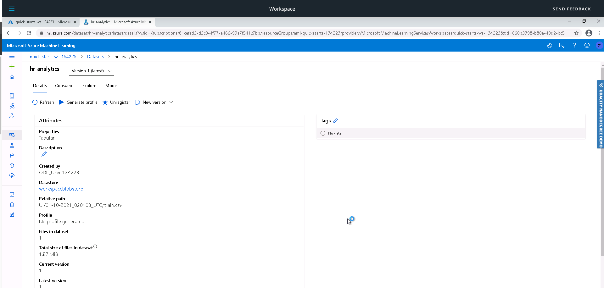
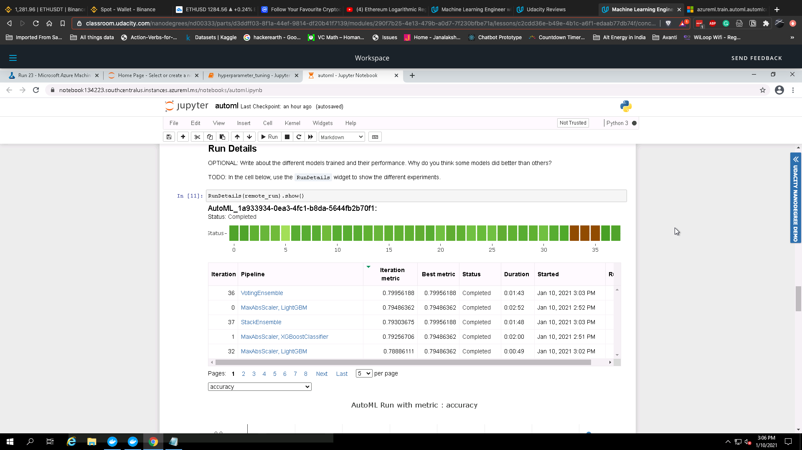
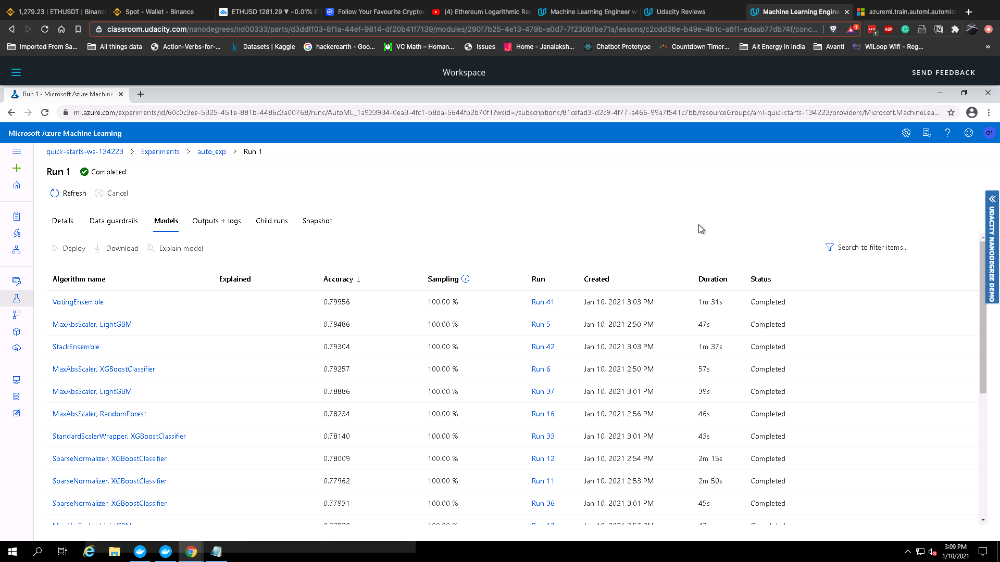
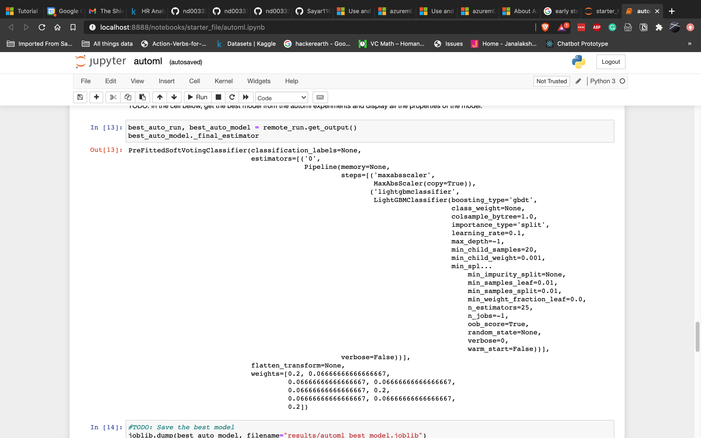
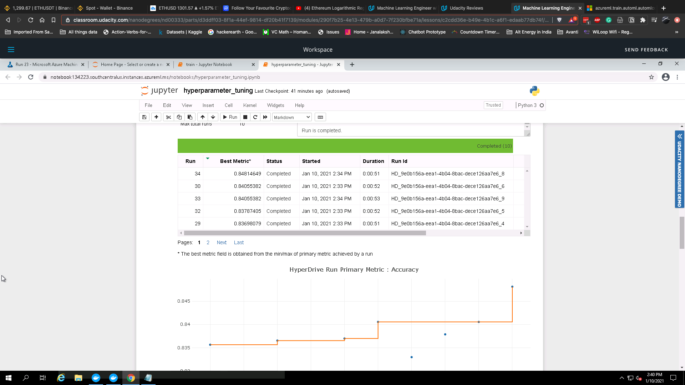
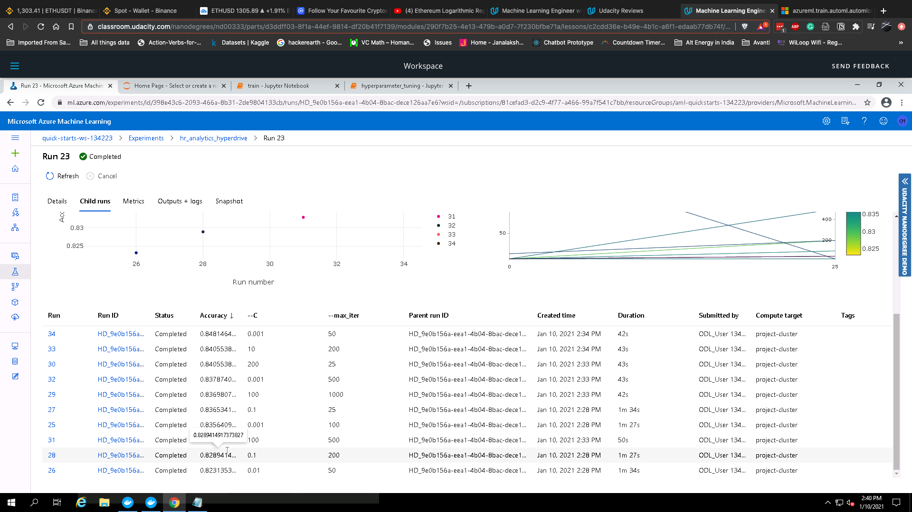
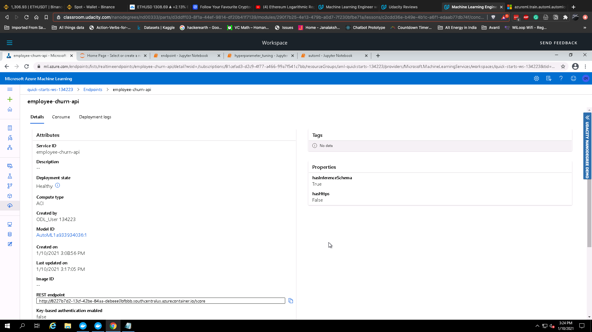
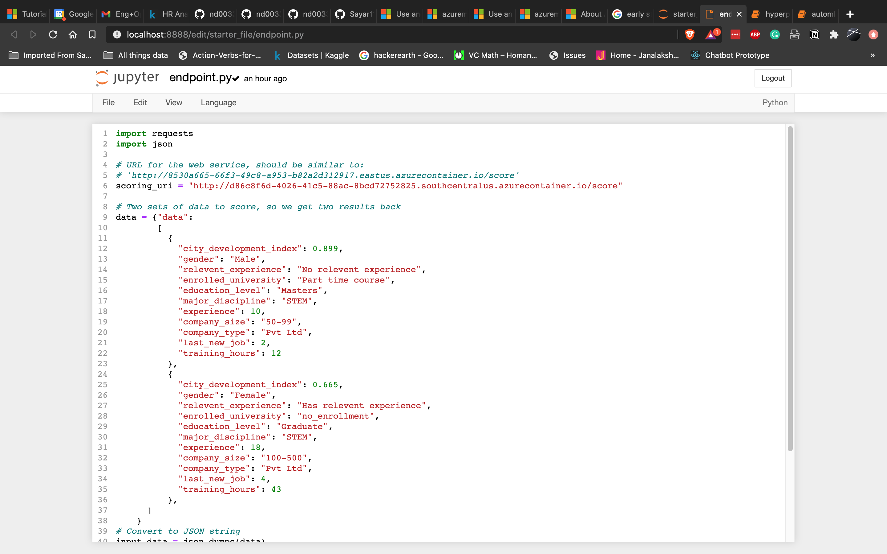
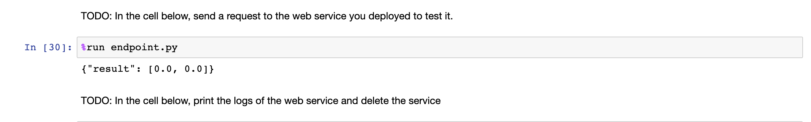

# HR Analytics: Job Change of Data Scientists

This project will attempt to forecast whether a person will leave their current job for another company. We will use Microsoft Azure ML to create two models. One will use the AutoML feature while the other will use Hyperdrive to optimize the hyperparameters of some vanilla machine learning model.

## Dataset

### Overview

Our dataset is taken from Kaggle. You can find it [here]("https://www.kaggle.com/arashnic/hr-analytics-job-change-of-data-scientists).
### Task

Our task will be to predict whether an employee will leave their current employer based on certain features. 

Features:

* enrollee_id : Unique ID for candidate
* city: City code
* city_ development _index : Developement index of the city (scaled)
* gender: Gender of candidate
* relevent_experience: Relevant experience of candidate
* enrolled_university: Type of University course enrolled if any
* education_level: Education level of candidate
* major_discipline :Education major discipline of candidate
* experience: Candidate total experience in years
* company_size: No of employees in current employer's company
* company_type : Type of current employer
* lastnewjob: Difference in years between previous job and current job
* training_hours: training hours completed
* target: 0 – Not looking for job change, 1 – Looking for a job change

### Access

The model is accessed by uploading the csv file downloaded from Kaggle into Microsoft Azure ML.



## Automated ML

Here are the configurations and settings used for the AutoML experiment:
```
automl_settings = {
    "experiment_timeout_minutes": 30,
    "task": "classification", 
    "primary_metric": "accuracy",
    "training_data": train_data,
    "label_column_name": "target",
    "n_cross_validations": 5,
    "enable_early_stopping": True,
    "featurization": "auto",
    "max_cores_per_iteration": -1,
    "max_concurrent_iterations": 4,
    "compute_target": cluster
}
```

The task is a binary classification problem. We use accuracy as our primary metric and also use cross validation of 5 folds. Iterations are processed concurrently so as to speed up our training time. We have also enabled early stopping so as to prevent overfitting.

Additionally, for auto feature scaling, we utilize  the "featurization" parameter whose value is set to "auto".

### Results






Our best performing model is the VotingEnsemble classifier with an accuracy of 79.956%.



One possible way to improve this model was to upsample/downsample the classes so as to prevent class imbalance. Another method to possibly improve the model could be by using more powerful algorithms like deep learning.

## Hyperparameter Tuning

The decision was to use Logistic Regression for this problem. The reasons are:
1. It's well suited for Binary Classification problems
2. It has better explainability as compared to more complex algorithms.
3. It is simple to train.

The range of hyperparameters used were:
1. Regularization parameter was set to between 0.001 to 200. Regularization helps prevent the model from overfitting by penalizing additional features.
2. Maximum iterations was set to between 25 and 1000.

The RandomParameterSampling method was used to search the hyperparameter grid.

### Results

Our best model tuned with Hyperdrive gave us an accuracy of 84.81%. The parameters were as follows:

1. Regularization (C): 0.001
2. Max iterations (max_iter): 50

In addition to upsampling/downsampling, we could have employed better feature engineering methods to improve the model performance.





## Model Deployment

The AutoML model was chosen for deploying. Azure Container Instance was used to deploy the model as a webservice. We used score.py template for the inference config and the number of cpu cores and memory for the web service was set to 1 and 1GB respectively.

The model can be consumed as a REST api by sending http requests to it. The scoring_uri returns a JSON response with the model's predictions.

### Deployed model



### Sample Input



### Result



## Screen Recording

[Link](https://www.youtube.com/watch?v=p8CyG4akRHg) to screen recording

## Standout Suggestions

Application insights were enabled in our model endpoint to log important metrics.

